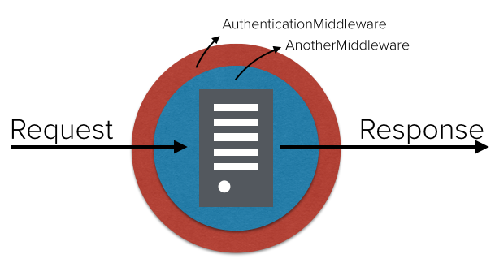
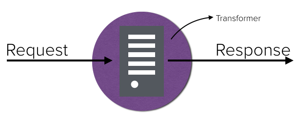

=======
Plugins
=======

It's possible to add functionalities to your APIs just by using plugins. Backstage supports two type: Middleware and Transformer.

Middleware
----------
Middleware is a wrapper around your API that decorates the requests without adding logic in the application. It's supposed to run before dispatching the request to the API. It's allowed to use as many middlewares as you want, since they implement the interface below:

.. highlight:: go

::

  type Middleware interface {
    Configure(cfg string)
    Serve(rw http.ResponseWriter, r *http.Request, next http.HandlerFunc)
  }

Writting a Middleware
~~~~~~~~~~~~~~~~~~~~~

.. highlight:: go

::

  package middleware

  import (
    "encoding/json"
    "net/http"

    "github.com/rs/cors"
  )

  type Cors struct {
    AllowedOrigins   []string `json:"allowed_origins"`
    AllowedMethods   []string `json:"allowed_methods"`
    AllowedHeaders   []string `json:"allowed_headers"`
    ExposedHeaders   []string `json:"exposed_headers"`
    AllowCredentials bool     `json:"allow_credentials"`
    MaxAge           int      `json:"max_age"`
    Debug            bool     `json:"debug"`
  }

  func NewCorsMiddleware() Middleware {
    return &Cors{}
  }

  func (c *Cors) Serve(rw http.ResponseWriter, r *http.Request, next http.HandlerFunc) {
    cors := cors.New(cors.Options{
      AllowedOrigins:   c.AllowedOrigins,
      AllowedMethods:   c.AllowedMethods,
      AllowedHeaders:   c.AllowedHeaders,
      ExposedHeaders:   c.ExposedHeaders,
      AllowCredentials: c.AllowCredentials,
      MaxAge:           c.MaxAge,
      Debug:            c.Debug,
    })
    cors.ServeHTTP(rw, r, next)
  }

  func (c *Cors) Configure(cfg string) {
    json.Unmarshal([]byte(cfg), c)
  }

After that, it's needed to add the middleware to the Gateway:

.. highlight:: go

::

  gw.Middleware().Add("AuthenticationMiddleware", AuthenticationMiddleware)

The response:

.. highlight:: bash

::

  HTTP/1.1 401 Unauthorized
  date: Thu, 14 May 2015 10:48:27 GMT
  content-length: 22
  content-type: text/plain; charset=utf-8
  Connection: keep-alive

  You must be logged in.

Using a Middleware
~~~~~~~~~~~~~~~~~~~~

To use a Middleware, you just need to use the name you used when adding it to the Gateway:

.. highlight:: go

::

  services := []*account.Service{&account.Service{Endpoint: "http://www.example.org", Subdomain: "example",Middlewares: []string{"AuthenticationMiddleware"}}}

Transformer
-----------
Transformer is supposed to run after the API response, just before writing the final response.

.. highlight:: go

::

  type Filter func(*http.Request, *http.Response, *bytes.Buffer)

Writting a Transform
~~~~~~~~~~~~~~~~~~~~

.. highlight:: go

::

  func FooTransformer(r *http.Request, w *http.Response, body *bytes.Buffer) {
    w.Header.Set("Content-Type", "text/plain")
    body.Reset()
    body.Write([]byte("Foo"))
  }

After that, it's needed to add the transformer to the Gateway:

.. highlight:: go

::

  gateway.Transformer().Add("FooTransformer", FooTransformer)

Using a Transform
~~~~~~~~~~~~~~~~~~~~

To use a Transformer, you just need to use the name you used when adding it to the Gateway:

.. highlight:: go

::

  services := []*account.Service{&account.Service{Endpoint: "http://www.example.org", Subdomain: "example",Transformers: []string{"FooTransformer"}}}